# 한종철 LMS — 데이터베이스 설계 (2026-07-15 개정)

> **기준**: 2026-07-14 baseline 설계(`lms-db-spec.html`, 7 도메인 24표)를 **2026-07-15 방향확정 회의**의 확정/변경 45건(서브시스템 13개)으로 **증분 확장(delta)**한 문서.
> **DBMS**: PostgreSQL. 프레임워크 비종속 — 순수 SQL DDL + 논리 스키마(Django ORM / SQLAlchemy 어느 쪽으로도 매핑 가능).
> **설계 원칙**: 정규화 3NF/BCNF 지향, 계산값만 선택적 비정규화(캐시), FK/UQ/NOT NULL 명시, 복합 인덱스는 선택도 높은 컬럼 우선, 스키마 변경은 expand-contract(무중단), 큰 파일은 경로만 저장, 상태·유형은 값 집합(CHECK 하드코딩 지양 → 값 추가 시 무마이그레이션).
> **허브 2개 유지**: `users`(계정) · `students`(학생/원번). 원번 `unique_id`는 단독 UQ가 아닌 **이름과 함께 쓰는 매칭키**, PK는 대리키(surrogate) `student_id` 유지.
>
> **⚠️ 2026-07-15 미결 해소(이 노트가 아래 본문보다 우선)**: ① 테마 = 신규 `theme_tag` 축(초기엔 중단원 값 복사) ② **동보 수강료 없음 → `tuition_charges` 표 삭제**(학원 과금은 커리큘럼[약 10주] 교재 1회 결제뿐, 동보는 추가 과금 없음) → **신규 표 16→15** ③ 질답↔문의 = **일단 통합**(단일 창구로 단일화, 분리 여지 유지) ④ 학부모 write 허용(RBAC) ⑤ 클리닉 대상 = **전체평균 자동(A) 기본** + `clinic_eligibilities.cutoff_score`로 관리자 컷값(B) 쉽게 교체. → 아래 본문의 `tuition_charges` 관련 표·DDL·인덱스·ERD는 **삭제 처리**로 읽을 것.

---

## 1. 개요 & 07-14 baseline 대비 변경 요약

### 1.1 이번 개정의 5대 구조 변화
1. **학부모의 계정화**: baseline `parents`(학생당 연락처 N:1)를 **로그인 계정(1:N 다자녀)**으로 승격. 계정↔자녀 M:N 연동표 신설, 다자녀 드롭다운 조회 지원. (6-2 결정 뒤집힘)
2. **출결(attendances)이 단일 원천(SSOT)으로 승격**: 출석 입력 한 번이 (a)복습영상 자동지급 (b)클리닉 대상 판정 (c)캘린더 도장 (d)학부모 리포트 대상의 **공통 트리거**. baseline의 신청기반 영상권한 흐름과 **자동지급 분기**를 병존.
3. **커리큘럼/일정 도메인 신설**: 강좌·주차·Day 학습계획·주차공지 → 로그인 후 **캘린더 홈**의 데이터 소스.
4. **문제은행 + 유사문항 파이프라인 신설**: 내신형/수능형 2종 문제은행, 문항→유사문항 2개 사전매칭, 오답·추가마킹 기반 **약점체크 PDF** 생성.
5. **관계 관리(결석상담·동보) 신설**: 결석 → 전화상담 기록 → 동보 체크 → 영상 자동지급으로 이어지는 체인. (~~수강료 청구~~ 는 동보 무과금 확정[헤더 노트 ②·8-8]으로 체인에서 제거 — 2026-07-22)

### 1.2 신규 표 (16)

| # | 표 | 도메인 | 근거(회의) |
|---|---|---|---|
| 1 | `parent_students` | 계정·학생 | 학부모 1:N 다자녀 연동 |
| 2 | `courses` | 커리큘럼(신규 도메인) | 강좌 마스터 |
| 3 | `course_weeks` | 커리큘럼 | 주차 + 오프라인 특이사항(주차공지) |
| 4 | `week_day_plans` | 커리큘럼 | 주 호버 시 Day1/Day2 학습계획 |
| 5 | `course_enrollments` | 커리큘럼 | 학생↔강좌/반, 캘린더 커리큘럼 표시 |
| 6 | `question_bank_items` | 문제은행(신규 도메인) | 내신형/수능형 2종 DB |
| 7 | `question_similar_maps` | 문제은행 | 문항→유사문항 2개 사전매칭 |
| 8 | `weakness_check_pdfs` | 성적/약점체크 | 학생별 약점체크 PDF 생성 기록 |
| 9 | `workbook_submissions` | 과제/워크북 | 워크북 사진 업로드·수행도 도장 |
| 10 | `makeup_grants` | 영상/동보 | 동보(동영상 보강) 기록 |
| 11 | `tuition_charges` | 결제/수강료 | 동보생 수강료 청구 |
| 12 | `clinic_slots` | 클리닉 | 요일×시간 슬롯·정원 |
| 13 | `clinic_eligibilities` | 클리닉 | 관리자 평균 입력 → 대상자 판정 |
| 14 | `absence_counselings` | 상담 | 결석 전화상담 기록 |
| 15 | `parent_counsel_requests` | 상담 | 학부모 상담 신청 기록 |
| 16 | `post_comments` | 게시판 | 질답/자유/이벤트 게시판 답글 |

### 1.3 변경 표 (11)

| # | 표 | 변경 요지 |
|---|---|---|
| 1 | `users` | 역할값에 `학부모` 추가, `must_change_password`·`password_changed_at`(일괄생성→SMS→변경) |
| 2 | `students` | `enrollment_status`(예비등록/등록/퇴원) 승격, 퇴원 이력 컬럼 (기존 `is_registered`는 동기 유지 후 폐기) |
| 3 | `parents` | `user_id`(로그인 계정) 추가, 학생 결합(`student_id`)을 `parent_students`로 이관 |
| 4 | `class_sessions` | `course_week_id` 추가(수업회차↔주차 매핑) |
| 5 | `attendances` | SSOT화 — `marked_by`·`updated_at`·`exam_taken`(현장 응시) 추가 |
| 6 | `questions` | `theme_tag`(잠정)·`study_guide`(오답 학습가이드)·`question_format`(내신/수능)·`guide_video_id` |
| 7 | `sheet_answers` | `extra_practice_marked`(더 풀고 싶은 문항 추가마킹) 인식·저장 |
| 8 | ~~`video_requests`~~ | **(폐기 2026-07-22)** 유튜브 흐름 전제가 소멸 — 도메인 4 [전면 개정] 참조, `video_grants` 가 대체 |
| 9 | `clinic_requests` | `slot_id`·`exam_id`·`cancelled_at`, 상태값 `취소` 추가 |
| 10 | `orders` | 학생·학부모 양측 결제(`initiated_by_user_id`·`billed_to_parent_id`), 청구 sync(`is_billed`·`charge_trigger`·부분 UQ) |
| 11 | `posts` | `course_week_id`(주차공지→캘린더), 카테고리 값 확장(질답/자유/이벤트굿즈) |

### 1.4 값만 추가(스키마 불변) · 참조 유지 표

- `notifications` — 대상 3분기(student/parent/user)와 `type`/`channel`/`status` **값 집합**이 이미 유연. 동보·수강료·상담·노쇼 등 신규 `type` 값만 추가(무마이그레이션). **신설 불필요, 그대로 재사용.**
- 변경 없음(참조만): `exams`, `answer_sheets`, `scores`, `assignments`, ~~`videos`~~(**2026-07-22 전면 개정 — 도메인 4 참조**), `products`, `payments`, `clinic_eval_criteria`, `clinic_evaluations`(녹음경로·AI요약 이미 보유), `clinic_evaluation_items`, `inquiries`, `inquiry_messages`.

### 1.5 잠정(TBD) 8건 — 본문에서 `-- 잠정` 주석으로 표기
학부모 write 범위 · 테마 태그 정의 · 질답↔문의 관계 · 클리닉 평균컷 기준 · 워크북 매핑키 · 동보 수강료 채널 · 퇴원 정의 · 결석생 답안직접입력(구현 보류). → 6장 참조.

---

## 2. 도메인별 표 명세

표기: 🆕 신규 · ✏️ 변경(ALTER) · ⚪ 참조(불변). 제약: PK/FK/UQ/NN(NOT NULL). 큰 파일은 `*_path`만.

### 도메인 1 — 계정 · 학생

#### ✏️ `users` (변경)
baseline 컬럼 유지(`user_id` PK, `login_id` UQ, `password_hash`, `role`, `name`, `phone`, `is_active`, `created_at`). 아래 추가.

| 컬럼 | 자료형 | 제약 | 설명 |
|---|---|---|---|
| must_change_password | BOOLEAN | NN, 기본 true | 최초 로그인 시 비번 변경 강제(일괄생성 계정) |
| password_changed_at | TIMESTAMP | NULL | 마지막 비번 변경 시각 |

- `role` 값집합 확장: `대표 / 관리자 / 조교 / 학생 / 학부모`(신규) / (미등록은 role=학생 + students.enrollment_status로 구분). 값 추가라 스키마 불변.
- **[구현 각주 2026-07-21]** Django `AbstractBaseUser`/`PermissionsMixin` 채택으로 위 명세 외 표준 컬럼 `last_login`(TIMESTAMP NULL), `is_superuser`(BOOLEAN NN)와 M2M 조인테이블 `users_groups`, `users_user_permissions`가 실제 DB에 추가로 생성된다(admin 운영·Django 권한 체계에 필요한 의도된 편차). `is_staff`는 컬럼으로 두지 않고 role 기반 property(대표·관리자·조교)로 산출한다. `password_hash`는 Django 관례 필드 `password`에 `db_column="password_hash"`로 매핑.

#### ✏️ `students` (변경)
baseline 컬럼 유지(`student_id` PK, `user_id` FK·UQ, `unique_id` 원번·매칭키, `grade`, `school`, `is_registered`, `registered_at`, `noshow_count`, `clinic_banned`, `credentials_sent_at`, `current_class`, ~~`youtube_email`~~ **← 삭제 2026-07-22**(유튜브 방식 폐기[PRD 3.1.3]의 종속 컬럼 정리 — 도메인 4 [전면 개정] 참조)). 아래 추가.

| 컬럼 | 자료형 | 제약 | 설명 |
|---|---|---|---|
| enrollment_status | VARCHAR(15) | NN, 기본 `예비등록` | `예비등록`/`등록`/`퇴원` — 등록 생애주기 단일 상태(soft-delete) |
| withdrawn_at | TIMESTAMP | NULL | 퇴원 처리 시각 |
| withdrawn_reason | VARCHAR(200) | NULL | 퇴원 사유 -- 잠정: '등록 안 한 학생' 정의 확정 필요 |
| withdrawn_by | BIGINT | FK users, NULL | 퇴원 처리자(담임/관리자) |

- 마이그레이션: `enrollment_status` 백필 = `is_registered=true→등록`, `false→예비등록`. 확정 후 `is_registered` 폐기(expand-contract). 원번(`unique_id`)은 이름과 함께 쓰는 매칭키로 **단독 UNIQUE 아님** 유지, PK는 `student_id` 유지.
- **원번 규칙 재개정(2026-07-29, 같은 날 두 번째)**: `unique_id` = `{이름}{휴대폰 뒷4자리}`(예 `김하늘0001`) — 이름이 들어가면서 **VARCHAR(20) → VARCHAR(30)** 확장(`accounts.0003`). 값은 관리자 입력이 아니라 파생값이고 준거는 `backend/apps/accounts/unique_id.py` 하나다.
  - 같은 날 오전 판의 `{학년1자리}{이름}{뒷4}`(`3김하늘4821`)는 **폐기**됐다 — 지면(OMR·워크북)에 들어오는 것이 "이름 + 뒷4자리"로 확정되면서 학년 자리가 설 자리가 없어졌다. `students.grade` 는 학생 정보로만 남는다.
  - 따라서 **원번은 승급으로 바뀌지 않는다**(`manage.py promote_grade` 는 `grade` 한 컬럼만 쓴다). `student_id`·`users.login_id` 와 함께 **셋 다 불변**(PRD 3.1.1 식별자 3종 표).
  - **원번은 중복될 수 있다**(동명이인 + 같은 뒷4자리). 아이디처럼 접미사(`a`·`b`…)로 해소하지 **않는다** — 접미사는 지면에 나타날 수 없어 대조되지 않기 때문. 그래서 단독 UNIQUE 를 두지 않고 인덱스만 둔다. 겹치면 자동매칭이 서지 않고 관리자가 고른다 — 상태값은 테이블마다 다르다: `answer_sheets.match_status` 는 `중복`(6분기), `workbook_submissions.match_status` 는 4종뿐이라 `불일치` 로 떨어진다(PRD 3.1.1 대조 6분기 · 3.1.7).
  - 폭 30 은 새 최대치(24자)보다 넉넉하지만 **줄이지 않는다** — 축소 `AlterField` 는 이미 저장된 구 형식 값을 자를 위험만 있고 얻는 것이 없다. `answer_sheets`·`workbook_submissions.recognized_unique_id` 도 같은 이유로 30 을 유지해 저장 가능한 원번과 인식 가능한 원번을 어긋나지 않게 한다.
- **퇴원 위치 결정**: 퇴원은 학생 생애주기 상태이므로 `students`에 단일 저장(SSOT). 출결 화면에서 퇴원 액션을 노출하되 `attendances.status`에 `퇴원` 값을 두지 않음(회차별 출결과 학생상태 분리 → 이중모델 방지).

#### ✏️ `parents` (변경) — 연락처 → 계정
baseline: `parent_id` PK, `student_id` FK(NN), `name`, `relation`, `phone`, `is_primary`. → 학생 결합을 `parent_students`로 이관하고 로그인 계정화.

| 컬럼 | 자료형 | 제약 | 설명 |
|---|---|---|---|
| parent_id | BIGINT | PK | 학부모(사람/계정) 내부번호 |
| user_id | BIGINT | FK users, UQ, NULL | 학부모 로그인 계정(1:1). **[구현 각주 2026-07-22: 영구 NULL 유지 — "NULL→NN 승격"은 하지 않는다. D-1 계정 발급 플로우(PRD 3.1.5)상 사람 행(연락처)이 계정보다 선행하므로 NULL 이 정상 상태(=계정 미발급). 발급 대상 판정은 `credentials_sent_at`(TIMESTAMP NULL, students 와 동일 패턴 — 2026-07-22 추가)]** |
| name | VARCHAR(50) | NULL | 학부모 이름 |
| phone | VARCHAR(20) | NN | 청구서·리포트·SMS 수신 연락처 |
| credentials_sent_at | TIMESTAMP | NULL | 계정정보(SMS) 발송 시각 — D-1 발급 배치 대상 판정, students 와 동일 패턴 **(2026-07-22 추가)** |
| created_at | TIMESTAMP | NN, 기본 now | |
| ~~student_id~~ | — | (폐기 예정) | → `parent_students`로 이관 |
| ~~relation~~ / ~~is_primary~~ | — | (폐기 예정) | → `parent_students`(자녀별로 다름) |

#### 🆕 `parent_students` — 학부모↔자녀 연동(M:N)
| 컬럼 | 자료형 | 제약 | 설명 |
|---|---|---|---|
| parent_id | BIGINT | PK, FK parents | |
| student_id | BIGINT | PK, FK students | 복합 PK (parent_id, student_id) |
| relation | VARCHAR(10) | NULL | 부/모/조부모 등 |
| is_primary_contact | BOOLEAN | NN, 기본 false | 해당 자녀의 주 수신처 |
| created_at | TIMESTAMP | NN, 기본 now | |

- 다자녀 드롭다운 = `SELECT ... FROM parent_students JOIN students WHERE parent_id=?`. 형제는 동일 학부모 연락처로 자동 그룹핑 가능(계정발급 로직 소관).
- **[구현 각주 2026-07-21]** Django 5.1에는 복합 PK(CompositePrimaryKey, 5.2+)가 없어 구현은 대리 PK `id` + `UNIQUE(parent_id, student_id)`로 동일한 유일성을 보장한다. Django 5.2 승급 시 복합 PK 전환을 재검토.

#### 🆕 `staff_feature_grants` — 직원 기능 권한 delta **(신설 2026-07-22)**
직원(관리자·조교) 세부 기능 접근의 **프리셋 ⊕ 개별 가감** 방식(PRD §4 2026-07-22 결정, key_considerations §2). 기능 키·역할 프리셋은 코드(`backend/apps/accounts/features.py`)가 정의하고, 이 표는 대표가 매트릭스 UI에서 가감한 **편차(delta)만** 저장한다. 유효 기능 = `effective_features(user)`(대표는 전권), 강제는 API 퍼미션 레벨.

| 컬럼 | 자료형 | 제약 | 설명 |
|---|---|---|---|
| id | BIGINT | PK | |
| user_id | BIGINT | FK users, NN | 대상 직원 |
| feature_key | VARCHAR(50) | NN | 기능 키 — **개방 값집합**(CHECK 없음, notifications.type 선례). 준거는 `features.FeatureKey` |
| is_granted | BOOLEAN | NN | true=프리셋에 추가 / false=프리셋에서 회수 (delta) |
| granted_by | BIGINT | FK users, NULL | 부여자(대표) |
| created_at / updated_at | TIMESTAMP | NN | |

- UQ(user_id, feature_key) — 직원당 기능 키 delta 1줄(매트릭스 토글의 upsert 단위). 대표 전용 민감 기능 범위는 추후 결정 — `features.OWNER_ONLY_FEATURES` 자리만 두고 값은 비움.

### 도메인 2 — 성적 / OMR / 과제

#### ⚪ `exams`, `scores`, `assignments`, `answer_sheets` (불변, 참조)
- `scores.is_taken`(응시 여부), `exams.avg_score`(전체평균 캐시)는 클리닉 대상 판정에서 재사용.

#### ✏️ `class_sessions` (변경)
baseline(`session_id` PK, `session_date`, `session_no`, `target_grade`, `exam_id` FK, `memo`). 추가:

| 컬럼 | 자료형 | 제약 | 설명 |
|---|---|---|---|
| course_week_id | BIGINT | FK course_weeks, NULL | 수업회차 ↔ 커리큘럼 주차 매핑(캘린더 커리큘럼 표시) |

#### ✏️ `attendances` (변경) — 출결 SSOT
baseline(`id` PK, `session_id` FK, `student_id` FK, `status`, `created_at`, UQ(session_id, student_id)). 추가:

| 컬럼 | 자료형 | 제약 | 설명 |
|---|---|---|---|
| exam_taken | BOOLEAN | NULL | 현장 시험 응시 여부 -- 잠정: scores.is_taken 재사용 vs 별도 축(클리닉 대상 판정용) |
| marked_by | BIGINT | FK users, NULL | 출결 입력자(담임) |
| updated_at | TIMESTAMP | NULL | 정정 추적(권한 회수 트리거 근거) |

- `status` 값집합: `출석`/`결석`/`지각`(baseline 유지). **와야 하는데 안 온 날 = status `결석` 레코드 존재**로 캘린더 결석 도장 판정(별도 스케줄 마스터 불필요 — 담임이 결석분도 입력).
- **트리거 관계(앱 레이어)**: `출석` 확정 → `video_grants`(source=`출석자동`, 2026-07-22 — 구 ~~video_requests~~ 폐기) 자동 생성 / `clinic_eligibilities` 판정 입력 / 캘린더 도장 / 리포트 대상.

#### ✏️ `questions` (변경)
baseline(`question_id` PK, `exam_id` FK, `q_number`, `answer`, `points`, `unit_major`, `unit_minor`, `wrong_rate`, UQ(exam_id, q_number)). 추가:

| 컬럼 | 자료형 | 제약 | 설명 |
|---|---|---|---|
| theme_tag | VARCHAR(50) | NULL | 테마(예: 중화반응) — 누적 테마별 정답률 집계축 -- 잠정: 중단원 재사용 vs 신규 태그 |
| study_guide | TEXT | NULL | 오답 시 학습가이드(관련 강의·개념서 페이지·코멘트). 첫해 수기→AI 학습데이터 |
| guide_video_id | BIGINT | FK videos, NULL | 학습가이드가 가리키는 복습영상 -- 잠정: 텍스트 vs 엔티티 참조 |
| question_format | VARCHAR(10) | NULL | `내신형`/`수능형` — 유사문항 조회 대상 DB 선택 |

#### ✏️ `sheet_answers` (변경)
baseline(`id` PK, `sheet_id` FK, `question_id` FK, `marked`, `result`, `is_corrected`, UQ(sheet_id, question_id)). 추가:

| 컬럼 | 자료형 | 제약 | 설명 |
|---|---|---|---|
| extra_practice_marked | BOOLEAN | NN, 기본 false | "더 풀고 싶은 문항" 추가 마킹란 인식값(정오 무관) |
| extra_mark_corrected | BOOLEAN | NN, 기본 false | 추가마킹 수동 보정 여부 |

- 약점체크 대상 = `result='오답' OR extra_practice_marked=true` 문항 → 각각 유사문항 2개.

#### 🆕 `question_bank_items` — 문제은행(내신형/수능형)
| 컬럼 | 자료형 | 제약 | 설명 |
|---|---|---|---|
| bank_item_id | BIGINT | PK | |
| bank_type | VARCHAR(10) | NN | `내신형`(개념확인)/`수능형` |
| content_path | VARCHAR(500) | NN | 문제 이미지/원고 파일 경로(큰 파일은 스토리지) |
| answer | VARCHAR(10) | NULL | 정답 |
| unit_major | VARCHAR(50) | NULL | 대단원 |
| unit_minor | VARCHAR(50) | NULL | 중단원 |
| theme_tag | VARCHAR(50) | NULL | 테마(문항 라벨링 연계) |
| difficulty | SMALLINT | NULL | 난이도(라벨링 툴) |
| labels | JSONB | NULL | 세부 라벨(확장) — GIN 인덱스 -- 잠정: 라벨링 툴 내부/외부 |
| source | VARCHAR(200) | NULL | 출처(저작권 검토 대상) |
| is_active | BOOLEAN | NN, 기본 true | |
| created_at | TIMESTAMP | NN, 기본 now | |

#### 🆕 `question_similar_maps` — 유사문항 사전매칭(문항→2개)
| 컬럼 | 자료형 | 제약 | 설명 |
|---|---|---|---|
| map_id | BIGINT | PK | |
| question_id | BIGINT | FK questions, NN | 원 시험 문항(원고 작성 시 매칭) |
| similar_bank_item_id | BIGINT | FK question_bank_items, NN | 유사문항 |
| ordinal | SMALLINT | NN, CHECK 1..2 | 1번/2번 유사문항 |
| created_at | TIMESTAMP | NN, 기본 now | |

- UQ(question_id, ordinal). 채점 후 오답·추가마킹 문항의 유사문항을 이 표에서 자동 조회. 원 문항의 `question_format`에 대응하는 `bank_type`에서 매칭.

#### 🆕 `weakness_check_pdfs` — 약점체크 PDF 생성 기록
| 컬럼 | 자료형 | 제약 | 설명 |
|---|---|---|---|
| pdf_id | BIGINT | PK | |
| exam_id | BIGINT | FK exams, NN | |
| student_id | BIGINT | FK students, NN | |
| pdf_path | VARCHAR(500) | NULL | 생성 PDF 경로(1p 성적표 + 유사문항 다시풀기) |
| page_count | SMALLINT | NULL | |
| status | VARCHAR(15) | NN, 기본 `생성대기` | `생성대기`/`생성완료`/`인쇄완료`/`실패` |
| generated_at | TIMESTAMP | NULL | |
| created_at | TIMESTAMP | NN, 기본 now | |

- UQ(exam_id, student_id) — 학생·시험당 1건.

#### 🆕 `workbook_submissions` — 워크북 사진 업로드
| 컬럼 | 자료형 | 제약 | 설명 |
|---|---|---|---|
| submission_id | BIGINT | PK | |
| student_id | BIGINT | FK students, NN | 매핑키 — **원번 기입칸 OCR 자동 매핑으로 확정(8-9, 2026-07-21)**, 인식 실패 시 관리자 수동 지정 |
| session_id | BIGINT | FK class_sessions, NULL | 어느 수업분 |
| image_path | VARCHAR(500) | NN | 워크북 마지막 페이지 사진(스토리지). 수기 코멘트는 OCR 대상 아님(사진 그대로 노출) |
| admin_original_text | TEXT | NULL | 관리용 원본 텍스트칸(조교 정서, 학생당 1개) |
| performance_grade | CHAR(1) | NULL | 수행도 ABC 도장(A/B/C) |
| recognized_unique_id | VARCHAR(30) | NULL | OCR 인식된 원번(지면 인쇄 기입칸 — 조교가 기입) **(2026-07-22 추가)**. **폭 10 → 30 (2026-07-29)** — 원번에 이름이 들어가면서 `students.unique_id` 와 같은 폭으로 맞춤(`grades.0004`, `answer_sheets` 동일 컬럼도 함께) |
| recognized_name | VARCHAR(50) | NULL | OCR 인식된 이름 **(2026-07-22 추가)** |
| match_status | VARCHAR(20) | NULL | `자동매칭`/`수동확정`/`불일치`/`인식실패` — answer_sheets 대조 패턴 재사용. NULL=OCR 파이프라인 밖(수동 지정 업로드 병행) **(2026-07-22 추가)** |
| uploaded_by | BIGINT | FK users, NULL | 업로드 조교 |
| created_at | TIMESTAMP | NN, 기본 now | |

- 학부모 리포트의 "과제 수행=사진 링크"로 연결. 과제 수행여부 플래그(`assignments.done`)는 baseline 유지(이원 관리).
- OCR 매핑 3컬럼은 §6 TBD 5(워크북 매핑키)의 8-9 결정 이행 — 예고대로 answer_sheets 패턴(recognized_*·match_status) 가산.

- **[구현 각주 2026-07-22]** 도메인 2 전체를 `backend/apps/grades`에 그린필드 최종 상태로 구현. 명세 대비 편차 3건: ① `questions.guide_video_id`는 videos 앱이 미구현(placeholder)이라 FK 제약 없는 BIGINT로 두고 `videos.Video` 구현 시 FK 승격. **→ 이행 완료(2026-07-22): `videos.Video` 구현으로 FK(videos, SET_NULL — 영상 삭제에도 문항 보존) 승격, 컬럼명 `guide_video_id` 유지.** ② `question_similar_maps.ordinal`의 CHECK 1..2는 DB CHECK 금지 원칙(값 추가 시 무마이그레이션)에 따라 앱 레벨 choices(1/2)로 강제. ③ §4의 단일 FK 컬럼 인덱스(`idx_attendances_student`, `idx_qsm_bank`, `idx_class_sessions_week`)는 Django FK 자동 인덱스와 컬럼이 동일해 별도 생성하지 않음(course_weeks 선례와 동일 원칙). `attendances.updated_at`은 명세(NULL=정정 이력 없음)대로 auto_now 없이 정정 시 앱 레이어에서 갱신.

### 도메인 3 — 커리큘럼 / 일정 (신규 도메인)

#### 🆕 `courses` — 강좌 마스터
| 컬럼 | 자료형 | 제약 | 설명 |
|---|---|---|---|
| course_id | BIGINT | PK | |
| name | VARCHAR(100) | NN | 강좌명(예: 로직엔제) |
| target_grade | SMALLINT | NULL | 대상 학년 |
| is_active | BOOLEAN | NN, 기본 true | |
| created_at | TIMESTAMP | NN, 기본 now | |

#### 🆕 `course_weeks` — 주차 + 주차공지
| 컬럼 | 자료형 | 제약 | 설명 |
|---|---|---|---|
| week_id | BIGINT | PK | |
| course_id | BIGINT | FK courses, NN | |
| week_no | SMALLINT | NN | 주차 번호(1주차/2주차…) |
| title | VARCHAR(100) | NULL | 주차 제목 |
| offline_notice | TEXT | NULL | 오프라인 특이사항(예: 오메가블랙 1회 응시) → 캘린더 표기 |
| start_date | DATE | NULL | |
| end_date | DATE | NULL | |

- UQ(course_id, week_no).
- **[구현 각주 2026-07-22]** 컬럼 추가: `release_at`(TIMESTAMP NULL) — 소비자(학생·학부모) 공개 시점. 근거: PRD §4 상태 기반 노출 원칙(콘텐츠 단위 — 커리큘럼·학습계획·주차 공지는 시작된 주차까지만, 관리자 조기 공개 오버라이드 가능)·PRD 3.2.0. 의미: NULL이면 `start_date`(주 시작일) 자정부터 공개(값 복제 없이 시작일 변경을 자동 추종), 설정 시 그 시각이 `start_date`보다 우선(조기 공개·연기), `start_date`까지 NULL이면 무기한 비공개(닫힘이 안전 기본값). 소비자용 API는 전부 `CourseWeek.objects.released()`(backend/apps/curriculum/models.py)를 거쳐 주차를 노출한다는 계약 — 강제 지점은 API 응답 레벨(§4).

#### 🆕 `week_day_plans` — Day 학습계획
| 컬럼 | 자료형 | 제약 | 설명 |
|---|---|---|---|
| plan_id | BIGINT | PK | |
| week_id | BIGINT | FK course_weeks, NN | |
| day_no | SMALLINT | NN | Day1/Day2… |
| title | VARCHAR(100) | NULL | |
| content | TEXT | NULL | 그 날 학습계획(주 호버 시 노출) |
| display_order | SMALLINT | NULL | |

- UQ(week_id, day_no).

#### 🆕 `course_enrollments` — 학생↔강좌/반
| 컬럼 | 자료형 | 제약 | 설명 |
|---|---|---|---|
| enrollment_id | BIGINT | PK | |
| student_id | BIGINT | FK students, NN | |
| course_id | BIGINT | FK courses, NN | |
| class_name | VARCHAR(30) | NULL | 반(반 이동 대응) |
| primary_weekday | SMALLINT | NULL | 주 수업 요일(0=일…6=토) -- 잠정: 다요일 반복 시 확장 |
| status | VARCHAR(15) | NN, 기본 `수강` | `수강`/`종료`/`중단` |
| enrolled_at | TIMESTAMP | NN, 기본 now | |
| ended_at | TIMESTAMP | NULL | |

- UQ(student_id, course_id). 캘린더가 "이 학생이 어느 강좌 몇 주차인지" 렌더하는 근거.

### 도메인 4 — 영상 / 동보 **[전면 개정 2026-07-22]**

> **개정 근거**: 2026-07-21 YouTube+RPA 폐기·외부 DRM 호스팅(Mux/VdoCipher 미정) 전환 확정(PRD 3.1.3·6-7) + 2026-07-22 DB 재검토. 구 절(⚪ videos 불변 · ✏️ video_requests 변경)은 **전부 폐기**한다:
> - ~~`video_requests`~~ — 유튜브 계정 수동 권한 부여/삭제 흐름(`youtube_email`·`grant_status` 대기→부여완료→삭제필요→삭제완료·`link_active`·`auto_granted`) 전제가 소멸. **만들지 않는다.** 권한의 원천은 신 `video_grants`(지급·만료·회수 이력)이며, 실제 부여/회수는 호스팅 API 반영(`sync_status`)으로 대체.
> - ~~`students.youtube_email`~~ — 유튜브 종속 컬럼 정리 시점(PRD 3.1.3) 이행, 2026-07-22 마이그레이션으로 **삭제**.
> - 아래 3표(`videos`·`video_grants`·`makeup_grants`)가 최종 상태. 구현: `backend/apps/videos/models.py`(§5의 구 도메인 4 DDL 은 폐기 — Django migration 이 스키마 원천).

#### 🆕 `videos` — 복습영상 마스터 (구 videos 표 대체, Provider 중립)
| 컬럼 | 자료형 | 제약 | 설명 |
|---|---|---|---|
| video_id | BIGINT | PK | |
| course_week_id | BIGINT | FK course_weeks, NULL | 강의/차시 분류 축(PRD 3.1.3)·지급 단위(주차)의 대상. NULL=주차 무관 특강 |
| title | VARCHAR(200) | NN | |
| sequence_no | SMALLINT | NULL | 차시 |
| provider | VARCHAR(20) | NULL | `mux`/`vdocipher` — **업체 미정이라 NULL 허용**. Provider 중립(payments 선례): 업체 종속 컬럼 금지, 확정·교체 시 값만 추가 |
| external_ref | VARCHAR(200) | NULL | 중립 외부 참조(Mux asset id / VdoCipher video id) |
| duration_seconds | INT | NULL | |
| status | VARCHAR(15) | NN, 기본 `준비중` | `준비중`/`공개`/`아카이브` — 소비자 노출은 `공개`+권한 이중 게이트, 시즌 종료 후 전량 보관은 아카이브(8-16) |
| created_at | TIMESTAMP | NN, 기본 now | |

- **부분 UQ**(provider, external_ref) WHERE external_ref IS NOT NULL — 연동 전(NULL) 다건 허용, 연동 후 동일 자산 이중 등록 차단.

#### 🆕 `video_grants` — 시청 권한 지급·만료·회수 이력 (구 video_requests 대체)
| 컬럼 | 자료형 | 제약 | 설명 |
|---|---|---|---|
| grant_id | BIGINT | PK | |
| student_id | BIGINT | FK students, NN | |
| course_week_id | BIGINT | FK course_weeks, NN | **지급 단위 = 주차**("그 주 복습영상" 묶음 — 영상별 행 복제 없음) |
| source | VARCHAR(15) | NN | `출석자동`(3.1.4 ①)/`동보`(3.2.3)/`학생신청`/`수동` |
| attendance_id | BIGINT | FK attendances, NULL, **부분 UQ** WHERE NOT NULL | 출석 자동지급 근거 — 출석 1건당 자동지급 1건 |
| makeup_id | BIGINT | FK makeup_grants, NULL, **부분 UQ** WHERE NOT NULL | 동보 지급 근거 — 동보 1건당 지급 1건 |
| granted_by | BIGINT | FK users, NULL | 수동 지급 처리자 |
| granted_at | TIMESTAMP | NN | 지급(부여일) |
| expires_at | TIMESTAMP | NN | 만료 예정 — **지급+7일 기본**(관리자 설정 변경 가능, PRD 3.1.4 ⑥). 기본값 산정은 앱 레이어(DB default 없음) |
| revoked_at | TIMESTAMP | NULL | 수동 회수(예외 처리) |
| sync_status | VARCHAR(15) | NULL | `대기`/`부여반영`/`회수반영`/`실패` — 호스팅 API 반영 상태. **연동 전 NULL 운영**(연동 후순위) |
| synced_at | TIMESTAMP | NULL | |
| created_at | TIMESTAMP | NN, 기본 now | |

- **소비자 API 유일 진입 = `VideoGrant.objects.active(at)`** (revoked_at IS NULL AND expires_at > at) — PRD §4 "권한 지급된 주차만"(curriculum `released()` 선례와 동일 계약). 인덱스 (student_id, expires_at) — 시청 페이지·만료 배치 축.

#### 🆕 `makeup_grants` — 동보(동영상 보강) 기록
| 컬럼 | 자료형 | 제약 | 설명 |
|---|---|---|---|
| makeup_id | BIGINT | PK | |
| student_id | BIGINT | FK students, NN | |
| attendance_id | BIGINT | FK attendances, NULL | 대상 결석 회차 |
| source | VARCHAR(15) | NN | `관리자체크`(전화상담 후)/`학생신청`(연락두절)/`학부모신청` |
| requested_by | BIGINT | FK users, NULL | 신청 주체(학생/학부모 계정) |
| status | VARCHAR(15) | NN, 기본 `신청` | `신청`/`승인`/`지급완료`/`거절` |
| ~~is_tuition_billable~~ | — | **(삭제 2026-07-22)** | 동보 무과금(헤더 노트 ②·8-8) — 수강료 체인 폐기로 미구현 |
| granted_at | TIMESTAMP | NULL | |
| created_at | TIMESTAMP | NN, 기본 now | |

- 동보 `지급완료` 전이 → `video_grants`(source=동보) 자동 생성(부분 UQ 가 1:1 백스톱). ~~`is_tuition_billable=true`면 `tuition_charges` 생성~~ **(폐기 — 동보 무과금)**.

### 도메인 5 — 결제 / 수강료

#### ⚪ `products`, `payments` (불변, 참조) · ✏️ `orders` (변경)
baseline(`order_id` PK, `student_id` FK, `product_id` FK, `amount`, `status`, `billed_to_phone`, `ordered_at`, `paid_at`, `delivered_at`). 추가:

| 컬럼 | 자료형 | 제약 | 설명 |
|---|---|---|---|
| initiated_by_user_id | BIGINT | FK users, NULL | 결제 개시자(학생 또는 학부모 계정) |
| billed_to_parent_id | BIGINT | FK parents, NULL | 청구 대상 학부모 |
| is_billed | BOOLEAN | NN, 기본 false | 청구서 발송(결제선생) 여부 = 중복청구 방지 플래그 |
| billed_at | TIMESTAMP | NULL | 청구 발송 시각 |
| charge_trigger | VARCHAR(15) | NULL | `첫수업`/`수동` — 주차 반복 아님 |
| source_session_id | BIGINT | FK class_sessions, NULL | 첫 수업 기준 근거 |

- **중복 청구·결제 방지**: 부분 UNIQUE `WHERE status <> '취소'` on (student_id, product_id). 학생·학부모 어느 경로든 활성 청구 1건. `is_billed`가 양측 sync 판정 근거.

#### 🆕 `tuition_charges` — 수강료 청구(동보생)
| 컬럼 | 자료형 | 제약 | 설명 |
|---|---|---|---|
| charge_id | BIGINT | PK | |
| student_id | BIGINT | FK students, NN | |
| makeup_id | BIGINT | FK makeup_grants, NULL, UQ | 동보로 인한 청구(1:1) |
| amount | INT | NULL | 금액(원) -- 잠정: 산정 기준 |
| billed_to_parent_id | BIGINT | FK parents, NULL | 청구 대상 |
| channel | VARCHAR(20) | NULL | `결제선생` 등 -- 잠정: 채널 재사용 여부 |
| status | VARCHAR(15) | NN, 기본 `청구대기` | `청구대기`/`청구`/`완료`/`미납` |
| billed_at | TIMESTAMP | NULL | |
| paid_at | TIMESTAMP | NULL | |
| created_at | TIMESTAMP | NN, 기본 now | |

- 교재(`orders`)와 분리. 결제 provider 추상화(`payments`)는 향후 확장 시 재사용 가능(TBD).

- **[구현 각주 2026-07-22]** 도메인 5를 `backend/apps/payments`에 그린필드 최종 상태로 구현(products·orders·payments 3표 + `uq_orders_active` 부분 UQ·`idx_orders_status`). 편차 3건: ① `tuition_charges`는 헤더 노트 ②(동보 무과금)대로 **미구현** — §4.7의 `idx_tuition_student_status`도 함께 소멸. ② `orders.status` 값집합에 `취소` 추가 — 부분 UQ `WHERE status <> '취소'`(§4.7)가 전제하는 값인데 baseline 값집합(미결제/결제완료/배부완료)에 누락되어 있어 보완(값 추가라 스키마 불변). ③ `payments.order` FK는 PROTECT — 결제 트랜잭션은 감사 기록이므로 주문 실삭제를 차단(파괴적 작업 수동 원칙, key_considerations §5).

### 도메인 6 — 클리닉

#### ⚪ `clinic_eval_criteria`, `clinic_evaluations`(녹음경로·AI요약 보유), `clinic_evaluation_items` (불변, 참조)
#### ✏️ `clinic_requests` (변경)
baseline(`clinic_id` PK, `student_id` FK, `requested_date`, `requested_time`, `status`, `assigned_staff_id` FK, `meet_url`, `attendance_status`, `attendance_marked_at/by`, `created_at/updated_at`). 추가:

| 컬럼 | 자료형 | 제약 | 설명 |
|---|---|---|---|
| slot_id | BIGINT | FK clinic_slots, NULL | 신청 시간대 슬롯 |
| exam_id | BIGINT | FK exams, NULL | 대상 판정 근거 시험 |
| cancelled_at | TIMESTAMP | NULL | 취소 시각(취소는 노쇼 미집계) |

- `status` 값 확장: `대기`/`승인배정`/`미승인`/`취소`. 노쇼 카운트·영구제한은 `students.noshow_count`·`clinic_banned`(baseline) 유지.

#### 🆕 `clinic_slots` — 요일×시간 슬롯·정원
| 컬럼 | 자료형 | 제약 | 설명 |
|---|---|---|---|
| slot_id | BIGINT | PK | |
| weekday | SMALLINT | NN | 0=일…6=토 (월~금 운영) |
| start_time | TIME | NN | 예: 19:00 |
| end_time | TIME | NN | 예: 20:00 |
| capacity | SMALLINT | NN, 기본 1 | 정원 — **1 고정**(구현 각주 ① 참조) |
| is_active | BOOLEAN | NN, 기본 true | |

- UQ(weekday, start_time).
- **[구현 각주 2026-07-28] 정원 1 고정**: 표의 원래 설명 "정원(조교 배정 수)"은 2026-07-15 회의 기준이었고 **2026-07-21 회의로 뒤집혔다** — "클리닉이 한 시간에 여러 개 일어나는 경우도 있나요?" → "시간별로 학생 한 명씩"(그래서 구글 미트 계정 1개로 충분). 정원은 관리자 설정값이 아니라 운영의 고정 사실이므로 `capacity`는 **컬럼을 유지한 채 1로 못 박았다**(마이그레이션 `clinic/0002_clinic_slot_capacity_fixed_one`): 기존 행 정규화 → `CHECK (capacity = 1)`(`ck_clinic_slots_capacity_one`) + `editable=False`. 컬럼을 남긴 이유는 ① 본 설계·baseline 스키마가 정의한 컬럼이라 삭제가 되돌리기 비싼 변경이고 ② 마감 판정식(활성 신청 수 ≥ capacity)이 컬럼을 그대로 읽어 1의 출처가 코드에 드러나며 ③ 운영 전제가 바뀌면 CHECK 완화만으로 열 수 있기 때문. 관리자 API·화면에는 정원 편집 경로를 두지 않는다. 값이 1뿐이라 소비자 응답에서 `capacity`/`remaining`은 폐지.
- **[구현 각주 2026-07-28] 날짜 축 조회**: 소비자 조회는 "요일 슬롯 + 슬롯별 next_date" 축을 폐기하고 `GET /api/student/clinic/availability?exam_id=&from=&to=`(날짜별 예약 가능 시간)로 이관했다 — 달력에서 날짜를 고르는 흐름(Calendly 형, PRD 3.2.4)을 그리려면 날짜 축 응답이 필요하다. 예약 가능 구간은 기본 14일·최대 31일(앱 레이어 상수).

#### 🆕 `clinic_eligibilities` — 대상자 판정
| 컬럼 | 자료형 | 제약 | 설명 |
|---|---|---|---|
| eligibility_id | BIGINT | PK | |
| exam_id | BIGINT | FK exams, NN | |
| student_id | BIGINT | FK students, NN | |
| is_target | BOOLEAN | NN, 기본 false | 대상자(활성화=`신청`) 여부 |
| cutoff_score | NUMERIC(6,2) | NULL | 관리자 입력 평균/컷 -- 잠정: 전체평균 vs 별도 컷 |
| reason | VARCHAR(30) | NULL | 미대상 사유(결석/미응시/평균이상) |
| determined_by | BIGINT | FK users, NULL | |
| determined_at | TIMESTAMP | NULL | |

- UQ(exam_id, student_id). 전제 = 출석(`attendances`) + 응시(`scores.is_taken`/`attendances.exam_taken`) + 평균미달.

- **[구현 각주 2026-07-22]** 도메인 6 전체를 `backend/apps/clinic`에 그린필드 최종 상태로 구현(슬롯·신청·판정 + baseline 평가 3표, §4.8 인덱스 포함). 편차·확정 2건: ① `clinic_evaluations`는 baseline 문구("클리닉 1건당 1개")를 OneToOne(UQ)로 DB 강제. ② 출석·응시 값은 `clinic_eligibilities`에 복사하지 않고 grades(`attendances`/`scores.is_taken`/`exams.avg_score`) 참조·계산 경로를 모델 docstring 계약으로 명시(cutoff_score NULL=전체평균 자동 판정 — 헤더 노트 ⑤). 정원 마감(활성 신청 수 ≥ capacity — capacity 는 1 고정, 2026-07-28 각주 참조)·전날 마감(당일 신청·변경·취소 불가 — 2026-07-29 확정, 구 "당일 8시 마감" 폐기)·**신청 창구의 끝**(신청 가능 날짜 ≤ `exams.exam_date` 다음에 오는 첫 화요일 — 2026-07-30 확정, `clinic/booking.py::booking_window_end` 가 유일한 계산 지점. 신청·변경에만 걸고 취소에는 걸지 않는다)·노쇼 누적(`students.noshow_count`/`clinic_banned`가 원천)은 앱 레이어 계약. 창구는 **컬럼을 만들지 않았다**: 시험일에서 순수 계산되는 값이라 저장하면 `exam_date` 와 어긋날 수 있는 사본이 하나 더 생긴다.

### 도메인 7 — 게시판 · 문의 · 상담

#### ⚪ `inquiries`, `inquiry_messages` (불변, 참조) · ✏️ `posts` (변경)
baseline(`post_id` PK, `category`, `title`, `body`, `author_id` FK, `is_published`, `created_at/updated_at`). 추가:

| 컬럼 | 자료형 | 제약 | 설명 |
|---|---|---|---|
| course_week_id | BIGINT | FK course_weeks, NULL | 주차 공지 → 캘린더 연동 |

- `category` 값 확장: `공지사항`/`정오표`/`질답`/`자유게시판`/`이벤트굿즈`. 학생·학부모 열람.

#### 🆕 `post_comments` — 게시판 답글
| 컬럼 | 자료형 | 제약 | 설명 |
|---|---|---|---|
| comment_id | BIGINT | PK | |
| post_id | BIGINT | FK posts, NN | |
| author_id | BIGINT | FK users, NN | 작성자(강사/관리자/학생) |
| body | TEXT | NN | |
| created_at | TIMESTAMP | NN, 기본 now | |

- 질답 답변·자유/이벤트 댓글용. -- 잠정: 질답 게시판이 `inquiries`(1:1 문의)와 별개인지 통합인지 관계 TBD.

- **[구현 각주 2026-07-22]** 도메인 7을 `backend/apps/boards`에 구현(posts·post_comments·absence_counselings·parent_counsel_requests). 편차 2건: ① `posts`에 `is_secret`(BOOLEAN NN 기본 false) 추가 — 2026-07-22 결정(PRD 3.3.1: 질답 **기본 공개 + 작성 시 비밀글 옵션**, 비밀글은 작성자·관리자만 열람). ② `inquiries`/`inquiry_messages`는 **미구현** — 헤더 노트 ③(질답↔문의 일단 통합, 단일 창구)에 따라 1:1 문의를 질답 비밀글로 흡수(위 TBD 를 통합으로 해소). 공개 Q&A/1:1 분리 재확정 시 표 신설로 대응(가산, 저위험 — §6 TBD 3 갱신).

#### 🆕 `absence_counselings` — 결석 전화상담 기록(관리자용)
| 컬럼 | 자료형 | 제약 | 설명 |
|---|---|---|---|
| counsel_id | BIGINT | PK | |
| student_id | BIGINT | FK students, NN | 결석생 |
| attendance_id | BIGINT | FK attendances, NULL | 결석 회차 |
| target | VARCHAR(10) | NN | `학부모`(1차)/`학생`(2차) |
| called_at | TIMESTAMP | NULL | 통화 일시(학생은 통화가능 시간대) |
| absence_reason | VARCHAR(300) | NULL | 결석 사유 |
| makeup_requested | BOOLEAN | NN, 기본 false | 동보 신청 여부 → makeup_grants 연계 |
| call_memo | TEXT | NULL | 통화 내용 |
| follow_up_action | VARCHAR(300) | NULL | 후속 조치(오프라인 콘텐츠·학습 대응) |
| status | VARCHAR(15) | NN, 기본 `대기` | `대기`/`완료`/`미연결` |
| counselor_id | BIGINT | FK users, NULL | 결석 담당자 |
| created_at | TIMESTAMP | NN, 기본 now | |

#### 🆕 `parent_counsel_requests` — 학부모 상담 신청 기록
| 컬럼 | 자료형 | 제약 | 설명 |
|---|---|---|---|
| request_id | BIGINT | PK | |
| parent_id | BIGINT | FK parents, NN | 신청 학부모 |
| student_id | BIGINT | FK students, NULL | 대상 자녀 |
| request_content | TEXT | NN | 상담 요청 내용 |
| status | VARCHAR(15) | NN, 기본 `접수` | `접수`/`진행`/`완료` |
| admin_reply | TEXT | NULL | 관리자 응답 메모 |
| requested_at | TIMESTAMP | NN, 기본 now | |
| handled_by | BIGINT | FK users, NULL | |
| handled_at | TIMESTAMP | NULL | |

### 도메인 8 — 알림

#### ⚪ `notifications` (불변, 참조 — 값만 추가)
baseline 그대로 사용(`notif_id` PK, `student_id`/`parent_id`/`user_id` 3분기 FK, `channel`, `type`, `title/body`, `ref_type/ref_id` soft-link, `sent_at`, `status`, `error_msg`, `created_at`). `type`에 `동보`/`수강료`/`결석상담`/`상담신청`/`클리닉리마인더` 등 값만 추가. `parent_id` FK는 계정화된 `parents` 재사용.

- **[구현 각주 2026-07-22]** `backend/apps/notifications`에 baseline 명세대로 생성(그린필드라 "재사용"이 아닌 신규 CREATE, §4.5 부분 인덱스 3종 포함). 편차 3건: ① `type`은 choices 를 필드에 바인딩하지 않는 **개방 값집합** — 발송 시점 확정 목록이 미결 8-17(2026-07-29 수신 예정)이라 값 추가 시 AlterField 마이그레이션조차 없게 함(알려진 값은 `Notification.Type` 상수로 제공, `수강료`는 tuition 삭제로 제외). ② 대상 3분기 "셋 중 하나만"은 DB CHECK 금지 원칙에 따라 앱 레벨 `clean()`으로 강제. ③ 대상 FK 3종은 PROTECT — 발송 이력은 감사 기록(파기는 8-1 수동 절차 소관).

---

## 3. Mermaid ERD

```mermaid
erDiagram
    users ||--o| students : "1:1 계정"
    users ||--o| parents : "1:1 학부모계정"
    parents ||--o{ parent_students : ""
    students ||--o{ parent_students : "자녀연동(M:N)"

    students ||--o{ course_enrollments : ""
    courses ||--o{ course_enrollments : ""
    courses ||--o{ course_weeks : ""
    course_weeks ||--o{ week_day_plans : ""
    course_weeks ||--o{ class_sessions : "주차매핑"
    course_weeks ||--o{ posts : "주차공지"

    class_sessions ||--o{ attendances : ""
    students ||--o{ attendances : ""
    class_sessions ||--o{ assignments : ""
    class_sessions ||--o| exams : "그날시험"

    exams ||--o{ questions : ""
    exams ||--o{ answer_sheets : ""
    exams ||--o{ scores : ""
    exams ||--o{ clinic_eligibilities : ""
    exams ||--o{ weakness_check_pdfs : ""
    students ||--o{ scores : ""
    students ||--o{ answer_sheets : "매칭후"
    answer_sheets ||--o{ sheet_answers : ""
    questions ||--o{ sheet_answers : ""

    videos ||--o{ questions : "학습가이드"
    questions ||--o{ question_similar_maps : "오답→유사"
    question_bank_items ||--o{ question_similar_maps : ""
    students ||--o{ weakness_check_pdfs : ""
    students ||--o{ workbook_submissions : ""
    class_sessions ||--o{ workbook_submissions : ""

    course_weeks ||--o{ videos : "차시분류"
    students ||--o{ video_grants : ""
    course_weeks ||--o{ video_grants : "지급주차"
    attendances ||--o| video_grants : "출석자동(1:1)"
    students ||--o{ makeup_grants : ""
    attendances ||--o{ makeup_grants : "결석분"
    makeup_grants ||--o| video_grants : "동보지급(1:1)"

    students ||--o{ orders : ""
    products ||--o{ orders : ""
    parents ||--o{ orders : "청구대상"
    orders ||--o{ payments : ""

    students ||--o{ clinic_requests : ""
    clinic_slots ||--o{ clinic_requests : ""
    exams ||--o{ clinic_requests : ""
    users ||--o{ clinic_requests : "배정조교"
    clinic_requests ||--o| clinic_evaluations : ""
    clinic_evaluations ||--o{ clinic_evaluation_items : ""
    clinic_eval_criteria ||--o{ clinic_evaluation_items : ""
    students ||--o{ clinic_eligibilities : ""

    students ||--o{ absence_counselings : ""
    attendances ||--o| absence_counselings : ""
    parents ||--o{ parent_counsel_requests : ""
    students ||--o{ parent_counsel_requests : "자녀"

    posts ||--o{ post_comments : ""
    students ||--o{ inquiries : ""
    inquiries ||--o{ inquiry_messages : ""

    students ||--o{ notifications : "대상=학생"
    parents ||--o{ notifications : "대상=학부모"
    users ||--o{ notifications : "대상=직원"
```



---

## 4. 핵심 인덱스 전략

> 원칙(SKILL): WHERE 컬럼 식별 → 선택도 높은 컬럼 우선 → JOIN·ORDER BY 반영 → 커버링/부분 인덱스. 모든 FK에 인덱스(조인·삭제 성능). UQ는 자동 인덱스이므로 중복 생성 금지.

### 4.1 성적표 조회 (학생·시험 단건 + 회차별 추이)
```sql
-- scores UQ(exam_id, student_id) 이미 존재. 학생 누적 추이(회차별)는 student 선행:
CREATE INDEX idx_scores_student_exam ON scores (student_id, exam_id);
-- 문항 채점표: 특정 답안지의 문항 나열 (UQ(sheet_id, question_id)가 커버) → 추가 불필요
-- 오답/추가마킹 문항만 스캔 (약점체크 소스): 부분 인덱스
CREATE INDEX idx_sheet_answers_weak ON sheet_answers (sheet_id)
  WHERE result = '오답' OR extra_practice_marked = true;
```
근거: 성적표 단건은 (exam, student) 등식 → UQ 활용. **회차별 추이**는 student 고정·exam 가변이므로 `student_id` 선행 복합.

### 4.2 학생/회차별 출결 집계
```sql
-- 회차별 출석부(세션 고정, 상태 집계):
CREATE INDEX idx_attendances_session_status ON attendances (session_id, status);
-- 학생 누적 출결(캘린더 도장) — 날짜순:
CREATE INDEX idx_attendances_student ON attendances (student_id);
```
근거: UQ(session_id, student_id)는 (session→student) 프리픽스만 커버. 학생 중심 누적 조회는 별도 `student_id` 선행 인덱스 필요.

### 4.3 오답 → 유사문항 조회
```sql
-- 문항→유사문항 2개 (UQ(question_id, ordinal) 활용). bank 역방향 조회용:
CREATE INDEX idx_qsm_bank ON question_similar_maps (similar_bank_item_id);
-- 문제은행 유형·단원 필터 + 라벨:
CREATE INDEX idx_qbank_type_unit ON question_bank_items (bank_type, unit_major, unit_minor)
  WHERE is_active = true;
CREATE INDEX idx_qbank_labels ON question_bank_items USING GIN (labels);
```
근거: 조회는 `question_id`(UQ 프리픽스)로 2건 → 인덱스 재사용. 유형+단원은 등식+등식이라 복합, 활성만 부분 인덱스로 축소.

### 4.4 캘린더 홈 집계 (학생·학부모, 월 단위)
```sql
-- 그 달의 출결/수업: class_sessions 날짜 범위 스캔
CREATE INDEX idx_class_sessions_date ON class_sessions (session_date);
CREATE INDEX idx_class_sessions_week ON class_sessions (course_week_id);
-- 학생의 강좌/주차 렌더:
CREATE INDEX idx_course_enrollments_student ON course_enrollments (student_id)
  WHERE status = '수강';
CREATE INDEX idx_course_weeks_course_no ON course_weeks (course_id, week_no);
```
근거: 캘린더는 날짜 범위(range) → `session_date` B-tree. 학생별 활성 수강만 부분 인덱스. 4.2의 `idx_attendances_student`가 도장 조회를 커버.

### 4.5 알림 발송 이력
```sql
-- 대상별 최신순 조회 (3분기 각각, 발송시각 DESC):
CREATE INDEX idx_notif_student_sent ON notifications (student_id, sent_at DESC) WHERE student_id IS NOT NULL;
CREATE INDEX idx_notif_parent_sent  ON notifications (parent_id,  sent_at DESC) WHERE parent_id  IS NOT NULL;
-- 실패 재발송 배치:
CREATE INDEX idx_notif_status ON notifications (status) WHERE status IN ('대기','실패');
```
근거: 대상 컬럼이 3분기 NULL 다수 → **부분 인덱스**로 크기·선택도 최적화. ORDER BY sent_at DESC를 인덱스로 흡수.

### 4.6 학부모 → 자녀 조회 (다자녀 드롭다운)
```sql
CREATE INDEX idx_parent_students_parent ON parent_students (parent_id);   -- 드롭다운
CREATE INDEX idx_parent_students_student ON parent_students (student_id); -- 역방향(자녀→학부모 알림)
CREATE UNIQUE INDEX uq_parents_user ON parents (user_id) WHERE user_id IS NOT NULL;
```
근거: PK(parent_id, student_id)는 parent 프리픽스만 커버 → 역방향(student→parents, 리포트 수신처) 위해 `student_id` 선행 별도 인덱스.

### 4.7 결제 중복 방지 / 상태 조회
```sql
-- 활성 청구 유일성(학생×교재) = 중복청구·양측 sync 근거:
CREATE UNIQUE INDEX uq_orders_active ON orders (student_id, product_id) WHERE status <> '취소';
CREATE INDEX idx_orders_status ON orders (status);
CREATE INDEX idx_tuition_student_status ON tuition_charges (student_id, status);
```

### 4.8 클리닉 슬롯 정원·대상자
```sql
-- 슬롯별 활성 신청 수(정원 체크):
CREATE INDEX idx_clinic_req_slot ON clinic_requests (slot_id, requested_date)
  WHERE status IN ('대기','승인배정');
CREATE INDEX idx_clinic_elig_student ON clinic_eligibilities (student_id) WHERE is_target = true;
```

---

## 5. 신규/변경 표 PostgreSQL DDL

> 변경 표는 **ALTER(expand)** 로 제시(무중단). 신규 표는 CREATE. 상태·유형은 값 집합이라 CHECK 하드코딩 지양(baseline 철학). 타임존은 운영 시 `TIMESTAMPTZ` 권장(baseline은 TIMESTAMP — 일관성 위해 유지).

### 5.1 변경 표 (ALTER)

```sql
-- users: 학부모 역할 + 비번 변경 강제
ALTER TABLE users
  ADD COLUMN must_change_password BOOLEAN NOT NULL DEFAULT true,
  ADD COLUMN password_changed_at  TIMESTAMP;
-- role 값집합에 '학부모' 추가(값만 — 스키마 불변)

-- students: 등록 생애주기 상태(퇴원) 승격
ALTER TABLE students
  ADD COLUMN enrollment_status VARCHAR(15) NOT NULL DEFAULT '예비등록', -- 예비등록/등록/퇴원
  ADD COLUMN withdrawn_at    TIMESTAMP,
  ADD COLUMN withdrawn_reason VARCHAR(200),                            -- 잠정: '등록 안 한 학생' 정의
  ADD COLUMN withdrawn_by    BIGINT REFERENCES users(user_id);
UPDATE students SET enrollment_status = CASE WHEN is_registered THEN '등록' ELSE '예비등록' END;
-- (contract 단계) 확정 후: ALTER TABLE students DROP COLUMN is_registered;

-- parents: 연락처 → 로그인 계정화
ALTER TABLE parents
  ADD COLUMN user_id BIGINT REFERENCES users(user_id);  -- 마이그레이션 후 UNIQUE·NOT NULL 승격
-- (contract) student_id/relation/is_primary → parent_students 백필 후 DROP

-- class_sessions: 수업회차 ↔ 커리큘럼 주차
ALTER TABLE class_sessions
  ADD COLUMN course_week_id BIGINT REFERENCES course_weeks(week_id);

-- attendances: 출결 SSOT
ALTER TABLE attendances
  ADD COLUMN exam_taken BOOLEAN,                          -- 잠정: scores.is_taken 재사용 여부
  ADD COLUMN marked_by  BIGINT REFERENCES users(user_id),
  ADD COLUMN updated_at TIMESTAMP;

-- questions: 테마/학습가이드/유형
ALTER TABLE questions
  ADD COLUMN theme_tag       VARCHAR(50),                 -- 잠정: 중단원 재사용 vs 신규 태그
  ADD COLUMN study_guide     TEXT,
  ADD COLUMN guide_video_id  BIGINT REFERENCES videos(video_id),  -- 잠정: 텍스트 vs 참조
  ADD COLUMN question_format VARCHAR(10);                 -- 내신형/수능형

-- sheet_answers: 추가 마킹란
ALTER TABLE sheet_answers
  ADD COLUMN extra_practice_marked BOOLEAN NOT NULL DEFAULT false,
  ADD COLUMN extra_mark_corrected  BOOLEAN NOT NULL DEFAULT false;

-- [폐기 2026-07-22] video_requests ALTER — 표 자체를 만들지 않는다(유튜브 흐름
-- 소멸, 도메인 4 [전면 개정] 참조). 신 videos/video_grants 스키마의 원천은
-- Django migration(backend/apps/videos/migrations/0001_initial.py).
-- ALTER TABLE video_requests
--   ADD COLUMN source        VARCHAR(15) NOT NULL DEFAULT '학생신청',
--   ADD COLUMN auto_granted  BOOLEAN NOT NULL DEFAULT false,
--   ADD COLUMN attendance_id BIGINT REFERENCES attendances(id),
--   ADD COLUMN makeup_id     BIGINT REFERENCES makeup_grants(makeup_id);

-- clinic_requests: 슬롯/대상시험/취소
ALTER TABLE clinic_requests
  ADD COLUMN slot_id      BIGINT REFERENCES clinic_slots(slot_id),
  ADD COLUMN exam_id      BIGINT REFERENCES exams(exam_id),
  ADD COLUMN cancelled_at TIMESTAMP;
-- status 값에 '취소' 추가(취소는 노쇼 미집계)

-- orders: 양측 결제 + 청구 sync
ALTER TABLE orders
  ADD COLUMN initiated_by_user_id BIGINT REFERENCES users(user_id),
  ADD COLUMN billed_to_parent_id  BIGINT REFERENCES parents(parent_id),
  ADD COLUMN is_billed        BOOLEAN NOT NULL DEFAULT false,
  ADD COLUMN billed_at        TIMESTAMP,
  ADD COLUMN charge_trigger   VARCHAR(15),                 -- 첫수업/수동
  ADD COLUMN source_session_id BIGINT REFERENCES class_sessions(session_id);
CREATE UNIQUE INDEX uq_orders_active ON orders (student_id, product_id) WHERE status <> '취소';

-- posts: 주차 공지 연동
ALTER TABLE posts
  ADD COLUMN course_week_id BIGINT REFERENCES course_weeks(week_id);
-- category 값에 질답/자유게시판/이벤트굿즈 추가
```

### 5.2 신규 표 (CREATE)

```sql
-- 계정·학생 -------------------------------------------------------------
CREATE TABLE parent_students (
    parent_id  BIGINT NOT NULL REFERENCES parents(parent_id),
    student_id BIGINT NOT NULL REFERENCES students(student_id),
    relation           VARCHAR(10),
    is_primary_contact BOOLEAN NOT NULL DEFAULT false,
    created_at TIMESTAMP NOT NULL DEFAULT now(),
    PRIMARY KEY (parent_id, student_id)
);

-- 커리큘럼/일정 --------------------------------------------------------
CREATE TABLE courses (
    course_id    BIGINT GENERATED ALWAYS AS IDENTITY PRIMARY KEY,
    name         VARCHAR(100) NOT NULL,
    target_grade SMALLINT,
    is_active    BOOLEAN NOT NULL DEFAULT true,
    created_at   TIMESTAMP NOT NULL DEFAULT now()
);
CREATE TABLE course_weeks (
    week_id        BIGINT GENERATED ALWAYS AS IDENTITY PRIMARY KEY,
    course_id      BIGINT NOT NULL REFERENCES courses(course_id),
    week_no        SMALLINT NOT NULL,
    title          VARCHAR(100),
    offline_notice TEXT,                      -- 오프라인 특이사항(주차공지)
    start_date     DATE,
    end_date       DATE,
    UNIQUE (course_id, week_no)
);
CREATE TABLE week_day_plans (
    plan_id       BIGINT GENERATED ALWAYS AS IDENTITY PRIMARY KEY,
    week_id       BIGINT NOT NULL REFERENCES course_weeks(week_id),
    day_no        SMALLINT NOT NULL,
    title         VARCHAR(100),
    content       TEXT,
    display_order SMALLINT,
    UNIQUE (week_id, day_no)
);
CREATE TABLE course_enrollments (
    enrollment_id   BIGINT GENERATED ALWAYS AS IDENTITY PRIMARY KEY,
    student_id      BIGINT NOT NULL REFERENCES students(student_id),
    course_id       BIGINT NOT NULL REFERENCES courses(course_id),
    class_name      VARCHAR(30),
    primary_weekday SMALLINT,                 -- 잠정: 다요일 반복 확장
    status          VARCHAR(15) NOT NULL DEFAULT '수강',
    enrolled_at     TIMESTAMP NOT NULL DEFAULT now(),
    ended_at        TIMESTAMP,
    UNIQUE (student_id, course_id)
);

-- 문제은행 -------------------------------------------------------------
CREATE TABLE question_bank_items (
    bank_item_id BIGINT GENERATED ALWAYS AS IDENTITY PRIMARY KEY,
    bank_type    VARCHAR(10) NOT NULL,        -- 내신형/수능형
    content_path VARCHAR(500) NOT NULL,       -- 큰 파일 = 경로만
    answer       VARCHAR(10),
    unit_major   VARCHAR(50),
    unit_minor   VARCHAR(50),
    theme_tag    VARCHAR(50),
    difficulty   SMALLINT,
    labels       JSONB,                       -- 잠정: 라벨링 툴 연계
    source       VARCHAR(200),
    is_active    BOOLEAN NOT NULL DEFAULT true,
    created_at   TIMESTAMP NOT NULL DEFAULT now()
);
CREATE TABLE question_similar_maps (
    map_id               BIGINT GENERATED ALWAYS AS IDENTITY PRIMARY KEY,
    question_id          BIGINT NOT NULL REFERENCES questions(question_id),
    similar_bank_item_id BIGINT NOT NULL REFERENCES question_bank_items(bank_item_id),
    ordinal              SMALLINT NOT NULL CHECK (ordinal BETWEEN 1 AND 2),
    created_at           TIMESTAMP NOT NULL DEFAULT now(),
    UNIQUE (question_id, ordinal)
);

-- 약점체크 PDF / 워크북 -------------------------------------------------
CREATE TABLE weakness_check_pdfs (
    pdf_id       BIGINT GENERATED ALWAYS AS IDENTITY PRIMARY KEY,
    exam_id      BIGINT NOT NULL REFERENCES exams(exam_id),
    student_id   BIGINT NOT NULL REFERENCES students(student_id),
    pdf_path     VARCHAR(500),                -- 경로만
    page_count   SMALLINT,
    status       VARCHAR(15) NOT NULL DEFAULT '생성대기',
    generated_at TIMESTAMP,
    created_at   TIMESTAMP NOT NULL DEFAULT now(),
    UNIQUE (exam_id, student_id)
);
CREATE TABLE workbook_submissions (
    submission_id       BIGINT GENERATED ALWAYS AS IDENTITY PRIMARY KEY,
    student_id          BIGINT NOT NULL REFERENCES students(student_id), -- 잠정 매핑키
    session_id          BIGINT REFERENCES class_sessions(session_id),
    image_path          VARCHAR(500) NOT NULL,   -- 경로만, OCR 불필요
    admin_original_text TEXT,                     -- 관리용 원본 텍스트칸(1개)
    performance_grade   CHAR(1),                  -- ABC 도장
    uploaded_by         BIGINT REFERENCES users(user_id),
    created_at          TIMESTAMP NOT NULL DEFAULT now()
);

-- 영상/동보 -----------------------------------------------------------
-- [전면 개정 2026-07-22] 도메인 4 신 3표(videos·video_grants·makeup_grants)의
-- DDL 원천은 Django migration(backend/apps/videos/migrations/0001_initial.py).
-- makeup_grants 는 is_tuition_billable 제거(동보 무과금 — 헤더 노트 ②) 외에
-- 위 명세와 동일. tuition_charges 는 미구현(헤더 노트 ② 삭제 처리).
CREATE TABLE makeup_grants (
    makeup_id           BIGINT GENERATED ALWAYS AS IDENTITY PRIMARY KEY,
    student_id          BIGINT NOT NULL REFERENCES students(student_id),
    attendance_id       BIGINT REFERENCES attendances(id),
    source              VARCHAR(15) NOT NULL,     -- 관리자체크/학생신청/학부모신청
    requested_by        BIGINT REFERENCES users(user_id),
    status              VARCHAR(15) NOT NULL DEFAULT '신청',
    -- is_tuition_billable [삭제 2026-07-22 — 동보 무과금(8-8)]
    granted_at          TIMESTAMP,
    created_at          TIMESTAMP NOT NULL DEFAULT now()
);
-- CREATE TABLE tuition_charges (...) [삭제 — 헤더 노트 ② 참조]

-- 클리닉 ---------------------------------------------------------------
CREATE TABLE clinic_slots (
    slot_id    BIGINT GENERATED ALWAYS AS IDENTITY PRIMARY KEY,
    weekday    SMALLINT NOT NULL,               -- 0=일..6=토
    start_time TIME NOT NULL,
    end_time   TIME NOT NULL,
    capacity   SMALLINT NOT NULL DEFAULT 1 CHECK (capacity = 1),  -- 한 타임 1명 고정(0721 회의)
    is_active  BOOLEAN NOT NULL DEFAULT true,
    UNIQUE (weekday, start_time)
);
CREATE TABLE clinic_eligibilities (
    eligibility_id BIGINT GENERATED ALWAYS AS IDENTITY PRIMARY KEY,
    exam_id        BIGINT NOT NULL REFERENCES exams(exam_id),
    student_id     BIGINT NOT NULL REFERENCES students(student_id),
    is_target      BOOLEAN NOT NULL DEFAULT false,
    cutoff_score   NUMERIC(6,2),                 -- 잠정: 전체평균 vs 별도 컷
    reason         VARCHAR(30),
    determined_by  BIGINT REFERENCES users(user_id),
    determined_at  TIMESTAMP,
    UNIQUE (exam_id, student_id)
);

-- 게시판/상담 ----------------------------------------------------------
CREATE TABLE post_comments (
    comment_id BIGINT GENERATED ALWAYS AS IDENTITY PRIMARY KEY,
    post_id    BIGINT NOT NULL REFERENCES posts(post_id),
    author_id  BIGINT NOT NULL REFERENCES users(user_id),
    body       TEXT NOT NULL,
    created_at TIMESTAMP NOT NULL DEFAULT now()
);  -- 잠정: 질답 게시판 ↔ inquiries 관계 TBD
CREATE TABLE absence_counselings (
    counsel_id       BIGINT GENERATED ALWAYS AS IDENTITY PRIMARY KEY,
    student_id       BIGINT NOT NULL REFERENCES students(student_id),
    attendance_id    BIGINT REFERENCES attendances(id),
    target           VARCHAR(10) NOT NULL,       -- 학부모/학생
    called_at        TIMESTAMP,
    absence_reason   VARCHAR(300),
    makeup_requested BOOLEAN NOT NULL DEFAULT false,
    call_memo        TEXT,
    follow_up_action VARCHAR(300),
    status           VARCHAR(15) NOT NULL DEFAULT '대기',
    counselor_id     BIGINT REFERENCES users(user_id),
    created_at       TIMESTAMP NOT NULL DEFAULT now()
);
CREATE TABLE parent_counsel_requests (
    request_id      BIGINT GENERATED ALWAYS AS IDENTITY PRIMARY KEY,
    parent_id       BIGINT NOT NULL REFERENCES parents(parent_id),
    student_id      BIGINT REFERENCES students(student_id),
    request_content TEXT NOT NULL,
    status          VARCHAR(15) NOT NULL DEFAULT '접수',
    admin_reply     TEXT,
    requested_at    TIMESTAMP NOT NULL DEFAULT now(),
    handled_by      BIGINT REFERENCES users(user_id),
    handled_at      TIMESTAMP
);
```

> **주의(생성 순서)**: `course_weeks`는 `class_sessions.course_week_id`·`posts.course_week_id` ALTER보다 먼저 생성. ~~`makeup_grants`는 `video_requests.makeup_id` ALTER보다 먼저 생성~~ (video_requests 폐기 — 2026-07-22. 신 도메인 4의 생성 순서는 Django migration 의존성이 관리: videos·makeup_grants → video_grants → questions.guide_video_id FK). baseline PK는 `BIGINT`(자동증가) — 신규 표는 `GENERATED ALWAYS AS IDENTITY`로 통일(baseline SERIAL/IDENTITY와 논리 동일).

---

## 6. 잠정(TBD) 항목 — 기본 가정 & 확정 시 마이그레이션 영향

| # | TBD 항목 | 기본 가정(모델링됨) | 확정 시 마이그레이션 영향 |
|---|---|---|---|
| 1 | **학부모 write 범위** | 조회 전용 + 동보신청·결제·상담신청 write 허용(`makeup_grants.source=학부모신청`, `orders.initiated_by_user_id`, `parent_counsel_requests`) | 범위 축소면 앱 RBAC만 조정(스키마 불변). 확대(성적 코멘트 등)면 신규 표 필요 — **저위험** |
| 2 | **테마(theme_tag) 정의** | `questions.theme_tag` nullable 신규 태그 축 신설(중단원과 별개) | "중단원 재사용"으로 확정 시 `theme_tag` 폐기하고 `unit_minor` 집계로 전환 → 뷰/쿼리 변경, 컬럼 DROP. `question_bank_items.theme_tag`도 동일 — **중위험** |
| 3 | **질답 게시판 ↔ 문의 관계** | `posts.category='질답'` + `post_comments`로 공개 Q&A, `inquiries`는 1:1 문의로 별개 유지 | "통합"으로 확정 시 `post_comments`↔`inquiry_messages` 병합 마이그레이션 → 데이터 이관 필요 — **중위험** |
| 4 | **클리닉 평균 미달 기준** | `clinic_eligibilities.cutoff_score`에 관리자 입력 컷값 저장(전체평균과 분리) | "전체평균(=exams.avg_score) 자동판정"으로 확정 시 `cutoff_score` nullable 유지·앱에서 자동계산 → **저위험**(컬럼 불변) |
| 5 | **워크북 사진 매핑키** | ~~조교 수동 지정~~ **→ 해소(8-9 결정 2026-07-21, 구현 2026-07-22)**: 원번 기입칸 OCR 자동매핑 확정 | 예고대로 `recognized_unique_id`/`recognized_name`/`match_status` 3컬럼 가산 완료(도메인 2 workbook_submissions 절 참조) — 수동 지정 업로드는 match_status NULL 로 병행 |
| 6 | **동보 수강료 청구 채널** | `tuition_charges` 독립 표 + `channel`(결제선생 가정) | "결제선생/PG 재사용"으로 확정 시 `payments`(provider 추상화)에 tuition FK 연결 또는 `orders` 일반화 → **중위험**(결제 도메인 통합) |
| 7 | **퇴원 '등록 안 한 학생' 정의** | `students.enrollment_status='퇴원'` + `withdrawn_reason`에 자유서술 | (a)재등록 미완료 vs (b)1주차 미출석 미전환 확정 시 `withdrawn_reason` 값집합/자동판정 로직만 조정 → **저위험** |
| 8 | **결석생 답안 직접입력→성적표 (구현 보류)** | 스키마 여지만: `answer_sheets.student_id`는 NULL 허용·`scan_image_path` NOT NULL이 제약. 직접입력은 미구현 | 구현 확정 시 `answer_sheets.scan_image_path`를 nullable로 완화 + `entry_source`(스캔/수기) 컬럼 추가 → **저위험**(가산) |

### 6.1 부수 설계 결정(회의 근거)
- **출결이 SSOT**: 출석 확정이 영상·클리닉·캘린더·리포트의 공통 트리거. 트리거 실행은 앱 레이어이며 DB는 `video_grants.source`·`attendance_id`로 근거만 기록(2026-07-22 — 구 video_requests 폐기). ~~유튜브 50계정 한도(8-2)·수동 권한 부여 병목~~ 은 DRM 전환(6-7)으로 소멸.
- **감사(audit) 이력**: 상담(`absence_counselings`/`parent_counsel_requests`), 알림(`notifications`), 영상권한(`video_grants` 지급·만료·회수 이력 — 2026-07-22 대체), 퇴원(`withdrawn_*`), 클리닉 판정(`clinic_eligibilities.determined_*`)에 처리자·시각을 남김.
- **soft-delete/상태 전이**: 등록(`enrollment_status`), 영상 만료(`link_active`/`expires_at`), 결제·청구(`status`/`is_billed`), 노쇼 제한(`clinic_banned`/`noshow_count`)은 상태 컬럼으로 관리(물리 삭제 지양).
- **보안**: 비밀번호는 `password_hash`만(원문 금지), 큰 파일(OMR·워크북·녹음·PDF)은 경로만, 개인정보(원번=전화기반·녹음)는 8-1 개인정보 처리방침과 연계(파기·동의). 접근은 RBAC(대표/관리자/조교/학생/학부모)로 최소권한.
```
